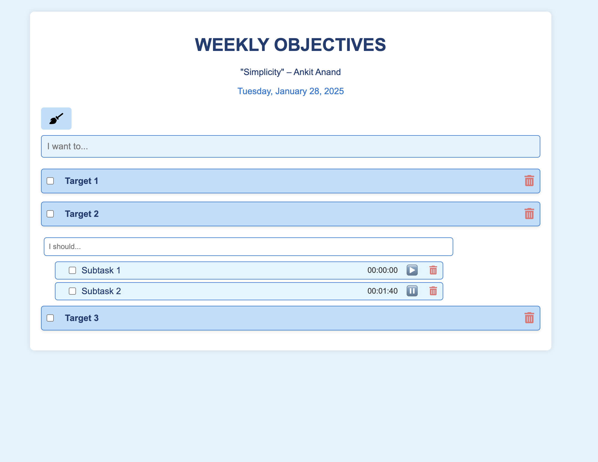

# Get Things Done
A simple yet powerful tool for managing managing weekly tasks

## Available Features
1. Edit the quote by clicking on it.
2. Change subtask order by drag and drop.
3. Time your subtasks.
4. Clear all the objectives using clear all button.